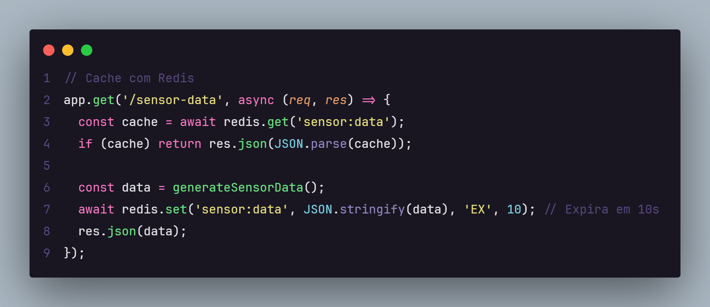
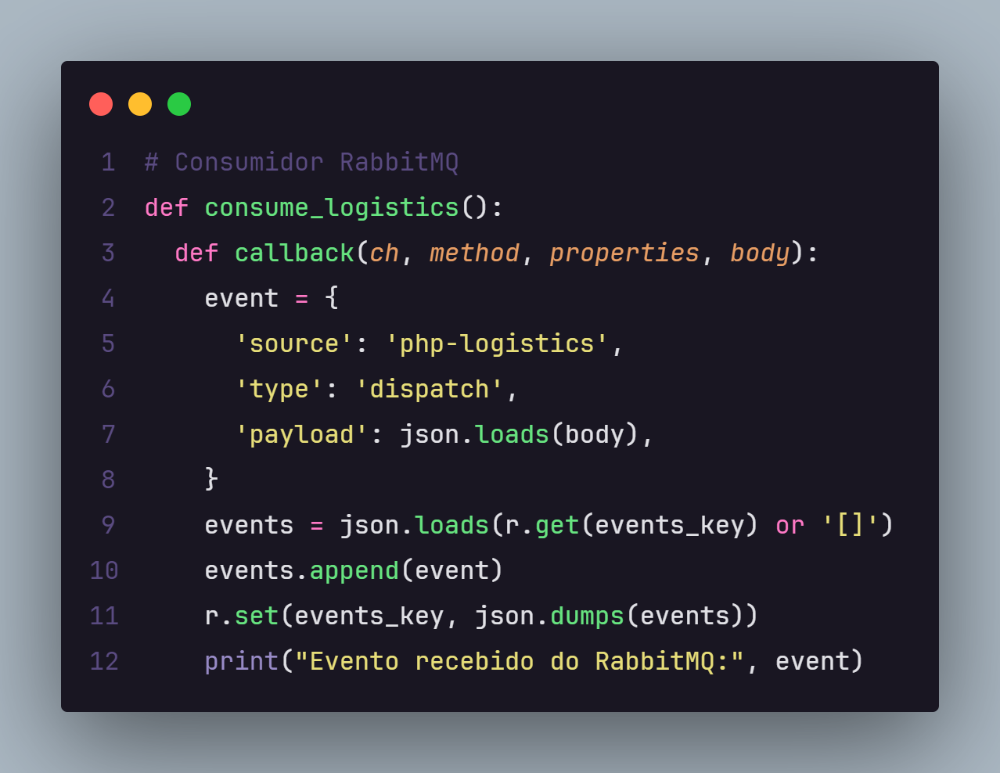
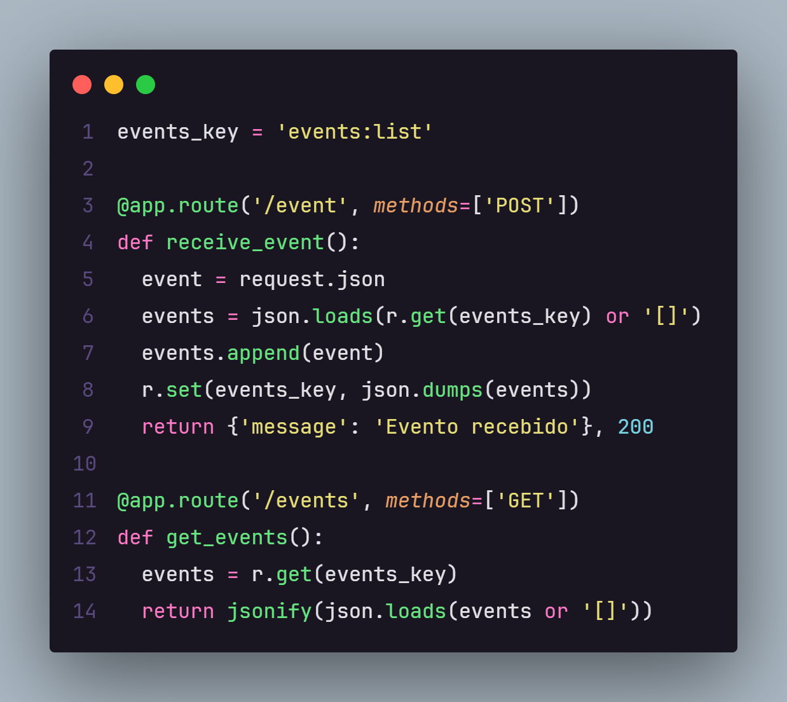

Texto Explicativo

O que cada API faz e como executá-la

API 1 – Node.js
GET /sensor-data: Retorna dados simulados de temperatura e pressão.
POST /alert: Envia um alerta para a API Python via HTTP.

**Execução:**
```
cd api-node
npm install
npm start
```

API 2 – Python
Recebe e armazena temporariamente os alertas recebidos.

POST /event: Recebe um alerta da API Node.js e o salva na memória (lista).
GET /events: Retorna todos os eventos recebidos.

**Execução:**
```
cd api-python
pip install flask redis pika
python app.py
```

API 3 – PHP
Gerencia envio de equipamentos e envia mensagens para a fila.

GET /equipments: Retorna uma lista simulada de equipamentos.
POST /dispatch: Envia uma mensagem para a fila do RabbitMQ.

Execução em Ambiente LINUX (Programei no WSL e não no windows):
```
cd api-php
sudo apt update
sudo apt install php php-cli php-mbstring unzip curl
php -r "copy('https://getcomposer.org/installer', 'composer-setup.php');"
php composer-setup.php --install-dir=/usr/local/bin --filename=composer
php -r "unlink('composer-setup.php');"
composer install
php -S localhost:8000
```

Comunicação entre as APIs

A API Node.js envia alertas diretamente para a API Python usando HTTP (POST /event).
A API PHP envia mensagens assíncronas para a API Python via RabbitMQ.
A API Python escuta a fila do RabbitMQ para processar mensagens de logística urgente.

Onde o Redis foi usado
Na API Node.js, o Redis é usado para cachear os dados simulados de sensores retornados por GET /sensor-data.

Segue em imagem abaixo:



Na API Python, o Redis armazena a lista de eventos recebidos via RabbitMQ. Conforme imagem abaixo:



Também na API Python, usamos nas requisições HTTP para pegar e também salvar na listagem que está no Redis

